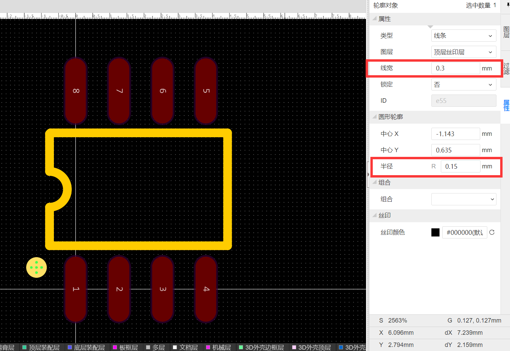
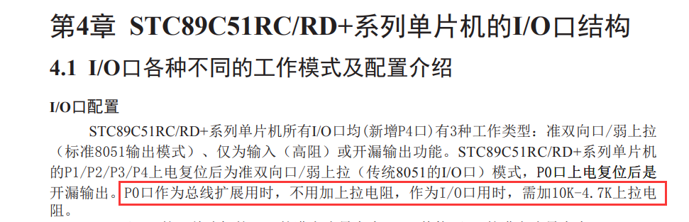
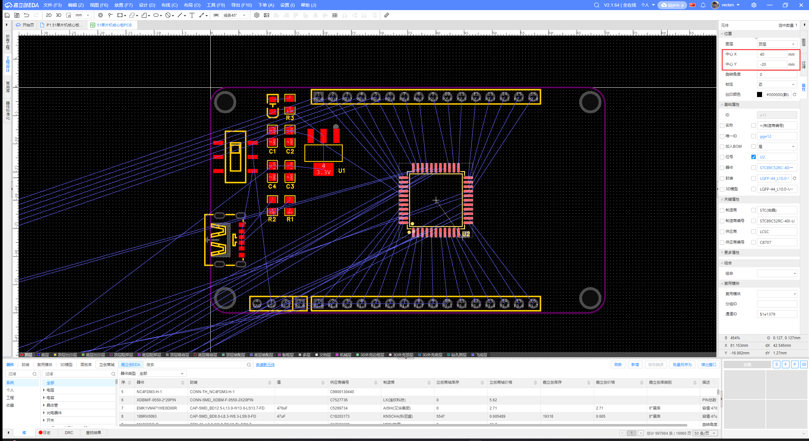
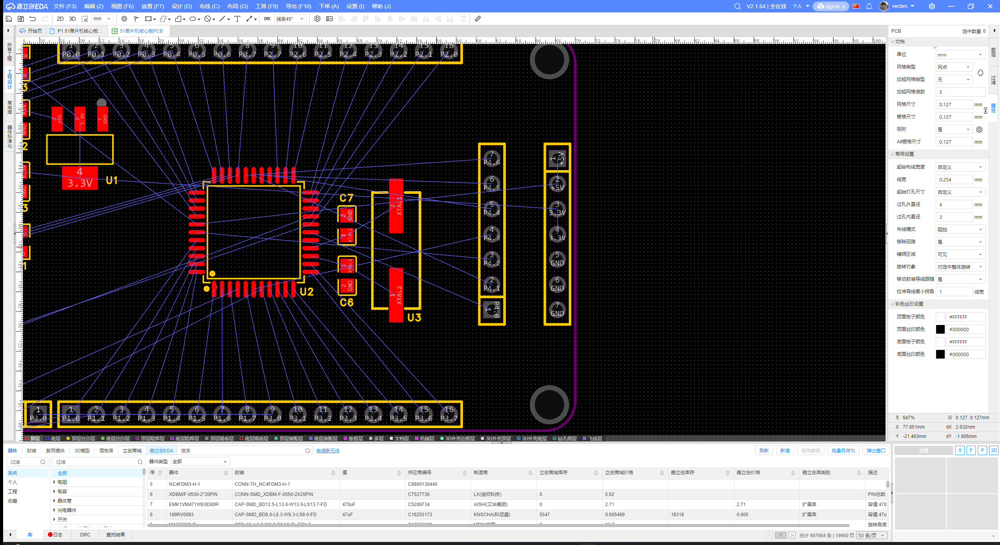
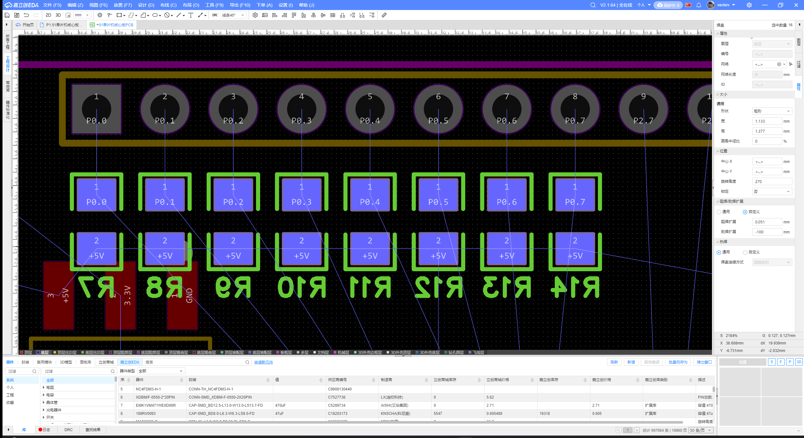
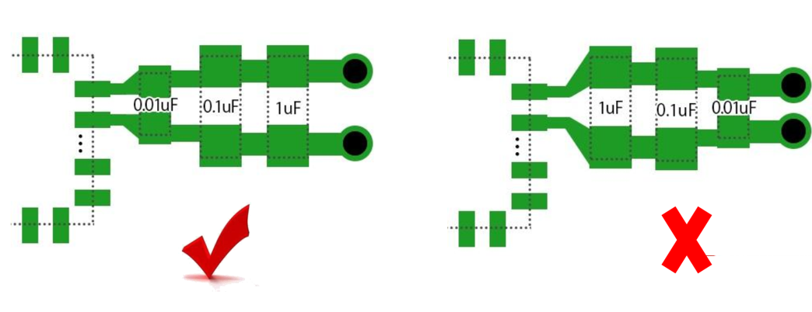
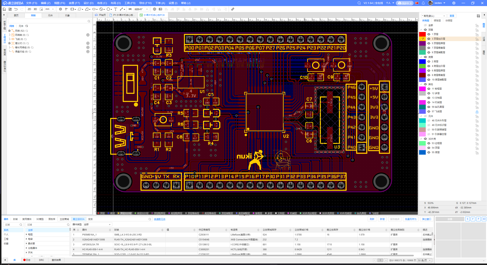

## 【入门篇】

- 电容通交流隔直流，电感通直流隔交流
- 肖特基二极管，比较低的导通压降

## 【P16】【强化篇】15-元件符号绘制

文件 > 新建 > 元件

- 半径改为 <u>0.01inch</u>

## 【P17】【强化篇】16-元件封装绘制

文件 > 新建 > 封装

- 查阅数据手册《C9418\_运算放大器\_LM358D\_规格书\_ST(意法半导体)运算放大器规格书》，“6.2 SO8 package information”，即 SOP 封装

### :one: 焊盘

- 图层：`LM358DT` 是表贴封装，需要修改焊盘的图层属性改为 <u>顶层</u>。这样就会变成顶层的表贴焊盘
- 形状：改为 <u>长圆形</u>
- 宽：从”Figure 28. SO8 package mechanical drawing”看出b是引脚的宽度，“Table 5. SO8 package mechanical data“中b对应的Min.和Max.分别为0.28和0.48，因为需要把引脚整个包住，焊盘宽度可以取得大一些如 <u>0.6mm</u>

- 高：查看L1典型值为1.04，可以取大一点为 <u>1.9mm</u>

焊盘的尺寸标注完成

元器件有8个引脚，首先复制出一侧的4个引脚，三种方法：

1. 复制粘贴法：中心X距离根据e的典型值 <u>1.27mm</u> 进行依次计算，第二个中心X距离为 <u>1.27mm</u>，第三个中心X距离为 <u>1.27*2mm</u>，第四个中心X距离为 <u>1.27*3mm</u>
2. 智能尺寸法：标注方法与 SolidWorks 几乎一致
3. 线性阵列法：放置 > 焊盘 > 条形多焊盘，点击原点，向右拉动，Tab 一次填数量 <u>4</u>，再 Tab 一次填距离 <u>1.27</u>，Enter 确定

全选复制粘贴另一侧焊盘，两侧焊盘距离应该是两侧焊盘中心点之间的距离，相当于 E1 + 焊盘的高 = 3.9 + 1.9 = 5.8

修改另一侧其中一个焊盘的位置“中心Y”为 <u>5.8mm</u>，框选另一侧的4个焊盘为顶部对齐

修改引脚的编号

- 第一个引脚放置在原点，剩下引脚应该逆时针排列

### :two: 丝印

- 右边栏：图层 > 顶层丝印层

第一种方法：

- 放置 > 线条 > 矩形

- 放置 > 线条 > 圆形，表明芯片正方向朝左

第二种方法：

- 放置 > 线条 > 中心圆弧
- 放置 > 线条 > 折线
- 放置 > 线条 > 圆形

绑定元件和封装

- 底部导航栏：库 > 器件 > 个人 > 右键器件 LM358DT > 关联封装，个人 > 点击封装 > 确定

测试封装

- 所有工程 > test1工程 
- 工程设计 > 打开原理图
- 底部导航栏 > 库 > 个人 > `LM358DT` > 放置
- 顶部导航栏 > 更新/转换原理图到PCB > 应用修改

- 3D视图

## 【P18】【强化篇】17-51单片机核心板元件选型

- `STC89C52RC`
  - XTAL（晶振，crystal oscillator）
  - 谐振电容、滤波电容

- 电源电路：Type-C接口分为：6PIN（仅供电）、16PIN（USB2.0）、24PIN（USB3.0）。仅需供电选 6PIN
- 5V转3.3V：LDO 芯片 `AMS1117`，经典的线性稳压器

- 外围功能电路：
  - 按键检测电路：单片机引脚检测按键，实现一些操作
    - 选择微动贴片按键
  - LED指示灯：指示系统状态
    - 0805贴片LED指示灯
  - 排针引出：方便调试和外接模块

## 【P19】【强化篇】18-51核心板电源&最小系统原理图设计

### :one: 电源电路部分

- `TYPE-C-6P-DIP2X2`
  - VBUS——电源正极
  - CC1、CC2——负责快充
    - CC（Configuration Channel，配置通道）
    - 不需要，5.1k（？？？）电阻接地
  - EH——固定的针脚

- `SS3235S-L1`——开关，2侧6个触点
  - 只需要1侧3个触点，另一侧不需要用直接接地
  - 开关输出需要接LDO（Low Dropout Regulator，低压差线性稳压器），给个+5V（？？？）

- `AMS1117-3.3_C6186`——LDO（Low Dropout Regulator，低压差线性稳压器）

- `LED_0805-G(LED_0805)`

- 滤波电容：参考 `AMS1117` 数据手册，得知输入输出电容都是 <u>10μF</u>
  - 选用 1 个 <u>10μF</u> 陶瓷电容和 1 个 <u>0.1μF(100nF)</u> 陶瓷电容并联使用（？？？，并联滤波效果更好，可以缩短缓冲时间）
  - 选用 `CAP_0805(C0805)`

### :two: 单片机的最小系统电路

- 选型：`STC89C52RC-40I-LQFP44`
- 一般芯片附近会加一颗 <u>0.1μF(100nF)</u> 的去耦电容（？？？，滤除高频噪声，使电压稳定干净，保证元件的正常工作）
- 快速添加网络标签：选中右键 > 扇出网络标签/非连接标识

**晶振电路**

- XTAL1、XTAL2引脚接 <u>12MHZ</u> 的外部晶振
- 选型：`ABLS-12.000MHZ-B4H-T`
  - 需要 2 个谐振电容，容值参考数据手册《C8707_单片机(MCU-MPU-SOC)_STC89C52RC-40I-LQFP44_规格书_STC(宏晶)单片机(MCU_MPU_SOC)规格书》，为 <u>47pF</u>

**单片机复位电路**

- <u>10K</u> 电阻和 <u>10μF</u> 电容

分析复位电路：

- 复位电路上电时，电容需要充电，会产生比较大的电流，电流经过 R4 会使 RST 进入高电平
- 随着电容充电完成，电流会逐渐减小，RST 会被下拉至 GND

由于 RST 是高电平复位，所以单片机上电时，电路就会自动进行复位

如果希望手动复位，可以在电容上并联一个按键，按下按键会被自动上拉至高电平，可以使单片机复位

- 按键选型：`轻触按键3*4*H`

**排针引出**

- 选型1：`HDR-M_2.54_1x16P(HDR-TH_16P-P2.54-V-M)`
- 选型2：`HDR-M_2.54_1x7P(HDR-TH_7P-P2.54-V-M)`

### :three: 按键电路

- 按键消抖：并上1个电容

### :four: LED 驱动电路

- IO口不能放在LED阳极，而要放在LED阴极
- 对于51单片机的IO口来说，电流输入能力远大于电流输出能力，即灌电流大于拉电流
- 当IO口输出低电平时，LED点亮；当IO口输出高电平时，LED熄灭

### :five: P0 口上拉电阻

- 根据《C8707\_单片机(MCU-MPU-SOC)\_STC89C52RC-40I-LQFP44\_规格书\_STC(宏晶)单片机(MCU_MPU_SOC)规格书》——“第4章 STC89C51RC/RD+系列单片机的I/O口结构”描述

### :six: 电源引出引脚

- 外接传感器有核心板供电，需要引脚将电源引出

### :seven: 串口引出引脚

- 方便外部通信和下载程序
- 串口引脚：RXD/P3.0、TXD/P3.1

## 【P20】【强化篇】19-51核心板外围功能电路原理图设计&DRC

**电路原理图成品**

**DRC 检测结果**

## 【P21】【强化篇】20-51单片机核心板PCB布局

### :one: 添加板框

点击【样板层】

矩形轮廓

- 坐标：(0, 0)
- 大小：70 * 40（宽和高不要超过100mm，否则打样收费了）

:two: 添加圆角

- 防割手、美观

框选 > 添加 > 添加圆角

- 倒角半径：3mm

### :three: 添加定位孔

过孔尺寸

- 外直径：4mm
- 内直径：3mm

位置坐标：(2.6, 2.6)

其他 3 个过孔的位置坐标分别是

- (2.6, 2.6-40) 或 (2.6, -37.4)
- (70-2.6, -2.6) 或 (67.4, -2.6)
- (70-2.6, 2.6-40)) 或 (67.4, -37.4)

### :three: 锁定

框选板框和定位孔，右键锁定

### :four: 预布局

选择顶层

电源电路 > 电源引出引脚 > 单片机 > 晶振电路 > 复位电路 > 按键加测电路 > LED灯电路

### :five: 布局

电源电路 > 单片机及上下排针 > 晶振电路 > 电源排针、P4引脚引出排针 > P0口上拉电阻 > 复位电路、按键检测电路、LED灯电路

- 隐藏GND网络 

- 滤波电容先大后小顺序放置：先经过大的滤波电容，再经过小的滤波电容
  - 比如 C2(10μF) > C1(100nF)，C2要远离芯片位置，C1贴近芯片引脚放置
- 先左右居中，再垂直等距分布
- 指示灯尽量放置在板子的边缘，和周围的器件保持同向放置，疏密尽量保持一致

- 芯片位置参考：(40, -20)

- 晶振电路：一定要注意靠近单片机引脚放置，尽量和晶振引脚保持轴对称（保证等长布线，即差分对）

- 电源引脚放边缘，P4引脚放内侧

- P0口上拉电阻：放置在P0口附近，尽量保持和引脚排针对齐，放置底层布线方便

- 复位电路、按键检测电路、LED灯电路
- 丝印被误删，勾选属性位号即可再次显示

3D视图

完成了一个摆放方向一致、疏密一致、按照电流流向路径以及各个功能模块的布局

## 【P22】【强化篇】21-PCB板布线原则

**PCB布线顺序**

1. ==不要自动布线==
2. ==顶层优先原则==
3. ==电源线加粗原则==：有利于电流在主干道上流通
   - <u>10mil</u> 线宽能承载 <u>0.65A</u> 电流
   - <u>40mil</u> 线宽能承载 <u>2.3A</u> 电流
4. ==同一层走线大于 90°==：推荐 <u>135°</u>，禁止 90° 或者走锐角
   - ①在腐蚀环节形成酸角效应，线宽变窄，走线发生断裂
   - ②阻抗不连续，影响信号传输
   - ③天线效应，走线上如果有高频信号时会对外产生电磁干扰

5. ==注意电流路径和电容的摆放位置==

- 电源先经过电容再给后级
- 去耦电容贴近芯片引脚位置，并就近过孔接地
- 多电容并联时，小容量电容更靠近芯片电源引脚

6. ==高频信号线尽可能短，并做好与其他信号线屏蔽隔离==：为了降低相邻走线之间的串扰，尽量避免相邻层平行走线，走线应遵循3W原则

   - **3W原则：两条线之间间距要大于3倍的线宽**

   

   - **相邻层信号线应采用正交方向**

   

   - **差分线布线尽量等距等长**：如晶振电路属于高频电路，要和外部低频电路隔离
     - *差分线*：两侧完全对称，为等长布线
     - *晶振外侧打一圈地过孔*：形成包地，很好隔离晶振信号和外围信号（类似法拉第笼电磁屏蔽）
     - *禁止布线层*：阻止顶部和底部的铺铜，保证晶振信号不会和外围信号产生互相干扰

7. ==PCB布线尽量远离安装孔和电路板边缘==
8. ==需要添加泪滴==
   - 平滑过渡
   - 连接稳固
   - 面积更大
   - 保护焊盘

**PCB布线顺序**

- ==密度优先：==
- ==关键元件优先==
- ==关键信号线优先==

安排：信号线布线 > 电源布线 > 底线铺铜

## 【P23】【强化篇】22-51单片机核心板PCB布线

隐藏电源线

### :one: GPIO引脚布线-上

- 长圆形的焊盘从短边出，若从长边出会形成两个直角

### :two: 晶振布线

**差分对布线**

- 正网络：XTAL1
- 负网络：XTAL2

**打一圈过孔**：快捷键 V 放置过孔，Tab录入：

- 网络：GND
- 外径：24mil
- 内径：12mil

> 同时注意 GND 之间的连线要加粗，选择 <u>20mil</u> 的线宽即可

**禁止布线层**

放置 > 禁止区域 > 多边形

### :three: GPIO引脚布线-下

### :four: P0口上拉电阻

### :five: P4口

### :six: 其他飞线

P3.0、P3.1、RST、P1.0

### :seven: 次重要的信号线

TypeC-CC1/CC2、RST、R5/R6/R3

此时，界面上已经看不到任何的飞线了

### :eight: 电源网络

显示3.3V、+5V、VCC+5V

> 注意，电源线要选择加粗，但不能超过焊盘宽度，否则会报错

先查看下 Type-C 焊盘的宽度为：<u>27.6mil</u>，可以选择电源线宽度为 <u>27mil</u>

> 技巧：快捷键 W 绘制导线，Tab 输入值 27
>
> 原则：布局要为布线让路

- 复位电路的 5V 需要接入经过滤波之后的 5V
- 电源电路的 3.3V 同理

### :nine: GND网络

GND网络一般通过铺铜来解决

> Q：要确保每一个GND网络都可以通过飞线连接上呢？
>
> A：在GND焊盘旁边为它放置一个过孔。
>
> - 1）方便GND网络进行连接
> - 2）可以连接底层地平面，提供比较好的回流路径

快捷键 V 放置过孔，Tab 选择网络为 GND

比较空的地方，特别是滤波电容的引脚附近

### 🔟 铺铜

工具栏 > 铺铜 > 矩形

==顶层铺铜==

- 图层：顶层
- 网络：GND

==底层铺铜==

信号线周围包上一层铜皮，可以更好保护信号的完整性

> 修正：所有过孔的网络选项必须为GND

修改后右键 > 铺铜区域 > 重建全部

修改后呈现的 3D 效果如下：

## 【P24】【强化篇】23-51核心板丝印&DRC&生产文件导出

### :one: 纠错

过滤 > 轮廓对象：隐藏铺铜区域

纠正错误

过滤 > 轮廓对象：显示铺铜区域

铺铜区域 > 重建全部

### :two: 丝印

图层 > 所有层 > 顶面 > 顶层丝印层

放置文本

- 字体：默认
- 线宽：5
- 高：50

或者

- 字体：三极芯片体 超粗
- 高：45

图层 > 所有层 > 隐藏顶层、底面（清爽一点）

放置丝印

放置圆形，标识开关方向

- 线宽：<u>20mil</u>
- 半径：<u>10mil</u>

最终效果

### :three: LOGO

==个人logo==

切换到顶层丝印层

放置 > 图片

调整大小和位置，最好跟芯片一样保持轴对称

查看3D效果

==芯片型号和厂家logo==

放置丝印

切换到顶层

3D效果

### :four: 其他丝印

### :five: DRC检查

- 开启“实时DRC”
- 手动“检查DRC”

### :six: 导出Gerber生产文件

==导出Gerber==

打开嘉立创下单助手

==领取优惠券==

> 嘉立创客户中心 > 用户中心 > 优惠券中心 > 免费券领取

==PCB下单==

> 嘉立创客户中心 > 电子产业 > PCB/FCB订单 > 计价/下单 > 上传 PCB 下单

- 板子数量：5

**基本信息**

- 板材类别：FR-4
- 确认生产稿：不需要

**PCB工艺**

- 成品板厚：0.8~1.6（免费）
- 阻焊颜色：哑黑色（有科技感）

**个性化服务**

- 版上加标志：加嘉立创客编
- 客编位置：无要求

**SMT贴片/激光钢网**

- 是否SMT贴片：不需要
- 是否开钢网：不需要

## 快捷键

- Q：单位
- Space：旋转 - 左向旋转
- X：翻转 - 左右翻转
- W（Wire）：绘制导线、单路布线
- R（Rectangle）: 矩形
- Shift+X：交叉选择
- Ctrl+Shift+X：布局传递
- B（Bottom）：切换到底层
- T（Top）：切换到顶层
- Alt+D：差分对布线
- V（Via Hole）：放置过孔
- F（Flip）：翻转板子
- Ctrl+Shift+L：左对齐
- Ctrl+Shift+R：右对齐
- Ctrl+Shift+O：顶部对齐
- Ctrl+Shift+B：底部对齐
- Ctrl+Shift+H：水平等距分布
- Ctrl+Shift+E：垂直等距分布
- Shift+B：重建全部

